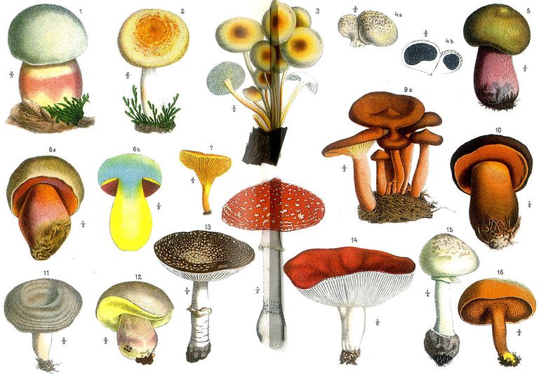

# Mushroom Data Explorer
***

## What is this app?

This app is a tool for data exploration, analysis, and modeling of mushroom data for a greater understanding of what characteristics make mushrooms edible or poisonous.  The source data can be found [here](https://www.kaggle.com/uciml/mushroom-classification/data#).

## How do I use it?

Navigate through the app using the tabs at the top. A high level overview of what each does presented below:

### I. Raw Data

This tab allows the user to scroll through the raw mushroom data in a tabular format.  The user has the option to view the full data set at once, or only the edible or poisonous mushroom observations.  By clicking the download button after clicking the data subset of choice, the user can also download either all or a subset of the data.  A data dictionary of the variables and their values is provided in the sidebar.

### II. Data Exploration

In this tab, the user can explore each of the predictor variables either individually or in pairs and explore how the relate to the response variable of mushroom class (edibile or poisonous).  The user can make this selection by specifying an interest in "One Variable Summary" or "Two Variable Summary".  With any of the analyses performed on this tab, the corresponding plots and underlying data can be downloaded by clicking the appropriate download button.  Further explanation of the features is given below:

**One Variable Summary**
With this option, the user can visualize any of the predictor variables individually, showing both a bar chart and frequency table of the variable's values.  The user has the option of splitting the variable of interest by the response variable.  Checking this box will split both the bar chart and frequency table by edible and poisonous mushrooms.

When users choose to split the variable by mushroom class, a second option presents itself: the choice to perform a Chi-Squared Test of Independence between the predictor variable and mushroom class.  The null hypothesis in this case is that the predictor variable and response variable are independent, i.e, having no relationship.  If the p-value is shown to be less than 0.05, then we can reject the null hypothesis and assume that there is some relationship between the predictor variable and mushroom class at the alpha=.05 level.

**Two Variable Summary**
With this option, the user can visualize any pair of the predictor variables together.  A side-by-side bar chart and two-way frequency table will be displayed for the chosen variables.  Here too there is the option of performing a Chi-Squared Test of Independence in order to test the null hypothesis that both chosen predictor variables are independent and have no relationship.

### III. Clustering
This tab allows the user to explore unsupervised groupings of the data using hierarchical clustering.  Because all of the variables in this data set are categorical, the "gower" method is used for the clustering.  The option of Agglomerative clustering with complete linkages was chosen.

In order to explore the clusters, the user has the option of selecting a desired cluster number as well as a color palette ("Pretty" or "Neutral").  The dendrogram of the data will change colors corresponding to the user selections to highlight the number of data observations within each cluster.

Note: Please be patient because this tab takes a few minutes to refresh with each change in user selection.

### IV. Modeling

This tab allows the user to explore two classification models to try and predict whether a particular mushroom is edible or poisonous. The two model types are K-Nearest Neighbors and a Classification Tree.  For both models, the full mushroom data was split into a train set with 80% of the data and a test set with the remaining 20%.  Cross Validation was performed on both methods on the training set in order to find the ideal number of neighbors/nodes for KNN and the decision tree respectively.  Descriptions of the exploratory abilities are given below:

**K-Nearest Neighbors**  

A plot of the classification accuracy from different K values for the number of neighbors obtained by cross-validation on the train is shown for the user's reference.  The user can select any value of K, and view the corresponding confusion matrix on the test dataset.  The user also has the option to input their own desired values for the predictor variables and predict the mushroom classification for any value of K.  They can choose the variable values with the corresponding dropdown menus and click "Make New Prediction" to see the result.

**Classification Tree**  

A plot of the classification accuracy from different complexity parameter (cp) values obtained by cross-validation on the train is shown for the user's reference.  The user can select any value for the complexity parameter, and the full classification tree will be pruned to that specification.  The user can also view the corresponding confusion matrix on the test dataset when the tree is pruned.  The user also has the option to input their own desired values for the predictor variables and predict the mushroom classification for any complexity parameter.  They can choose the variable values with the corresponding dropdown menus and click "Make New Prediction" to see the result.

 

## Who made it?

Saara Raja is a masters student in the Statistics department of North Carolina State University.

